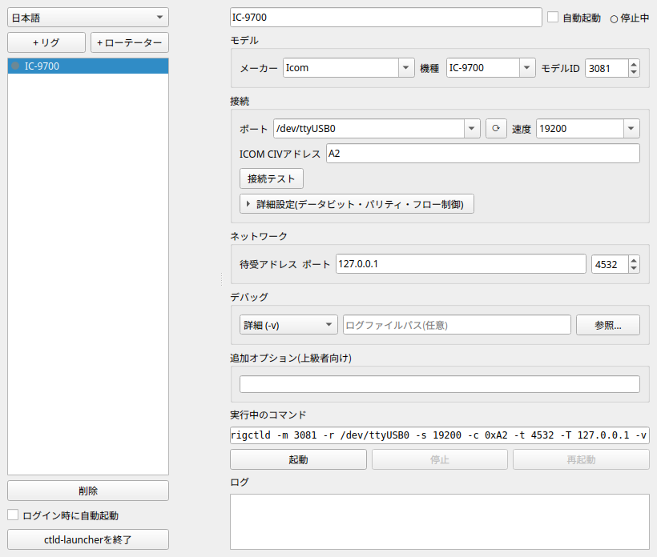

# ctld-launcher

Hamlibの`rigctld`(リグ制御デーモン)/`rotctld`(ローテーター制御デーモン)を、コマンドラインではなくGUIから設定・起動できるランチャーアプリです。

リグ/ローテーターのメーカー・機種、シリアルポート、通信速度などをプルダウンから選ぶだけで`rigctld`/`rotctld`を起動できます。Hamlib本体(`rigctld`/`rotctld`/`rigctl`/`rotctl`、バージョン4.7.1)を同梱しているため、別途Hamlibをインストールする必要はありません。

Linux/Windows/macOSに対応しています。



開発の背景・アーキテクチャなど技術的な詳細は[CLAUDE.md](CLAUDE.md)を参照してください。

## インストール方法

[Releases](https://github.com/JF9SOM/ctld-launcher/releases)ページから、お使いのOS用のファイルをダウンロードしてください。

### Linux

`ctld-launcher-x86_64.AppImage`をダウンロードし、実行権限を付けて起動します。

```bash
chmod +x ctld-launcher-x86_64.AppImage
./ctld-launcher-x86_64.AppImage
```

### Windows

`ctld-launcher-Setup.exe`をダウンロードして実行し、インストーラーの案内に従ってください。「WindowsによってPCが保護されました」という警告が出た場合は、「詳細情報」→「実行」を選んでください(未署名のためこの警告が出ますが、内容は本リポジトリのビルドそのものです)。

### macOS

`ctld-launcher.dmg`をダウンロードして開き、中の`ctld-launcher.app`をApplicationsフォルダなどにコピーしてください。初回起動時に「開発元が未確認のため開けません」と表示される場合は、Finderでアプリを**右クリック(control+クリック)→「開く」**を選び、表示されるダイアログで「開く」を選んでください(Apple公証を行っていないための表示で、2回目以降は通常通りダブルクリックで起動できます)。

## 設定方法

起動すると、左側にプロファイル一覧、右側に設定フォームが表示されます。

1. 左上の「+リグ」または「+ローテーター」ボタンで新しいプロファイルを追加します。
2. 右側フォーム最上部の名前欄で、プロファイルに分かりやすい名前を付けます(例: 「IC-9700」)。
3. 「モデル」欄で、リグ/ローテーターのメーカーと機種を選びます。メーカー・機種のプルダウンは入力して絞り込み検索ができます。リストにない機種の場合は「モデルID」欄にHamlibの機種番号を直接入力することもできます。
4. 「接続」欄で、リグ/ローテーターを繋いだシリアルポートと、無線機側で設定されている通信速度を選びます。後からケーブルを挿した場合は、ポート欄横の再検出ボタンで一覧を更新できます。
   - ICOMリグの場合のみ「ICOM CIVアドレス」欄が表示されます。無線機側の設定画面に表示されているアドレスをそのまま入力してください(例: `A2`。`0x`を付ける必要はありません)。ICOM以外のメーカーでは空欄のままで構いません。
   - データビット・パリティ・フロー制御などの詳細設定は、通常は「(未指定)」のままで問題ありません。無線機やインターフェースの説明書に特別な指定がある場合のみ変更してください。
5. 「ネットワーク」欄では、`rigctld`/`rotctld`が待ち受けるアドレスとポート番号を設定します。通常は127.0.0.1のままで構いません(このPC内のソフトからのみ接続可能)。他のPCからも接続させたい場合のみ0.0.0.0に変更してください。ポート番号はリグ制御ソフト側の設定とも一致させる必要があります(デフォルトはリグ4532/ローテーター4533)。
6. 必要であれば「デバッグ」欄でログの詳細度やログファイルの保存先を指定できます。
7. 各項目にマウスカーソルを乗せると、ツールチップで簡単な説明が表示されます。迷ったときはツールチップを確認してください。

設定内容は自動的に保存されるので、保存ボタンを押す必要はありません。

## 使い方

- 設定が終わったら「起動」ボタンを押すと`rigctld`/`rotctld`が起動します。フォーム下部の「実行中のコマンド」欄で、実際に実行されるコマンドライン全体を事前に確認できます。
- 起動前に「接続テスト」ボタンを押すと、`rigctl`/`rotctl`で一度だけ問い合わせを行い、ポート・速度・機種設定が正しいかを確認できます。無線機の電源が入っていない・ケーブルが未接続の場合、`rigctld`自体は起動してもリグ制御ソフトからの応答がなくなるため、起動前にこのテストで確認することをおすすめします。
- 「停止」「再起動」ボタンで、起動中のプロセスを停止・再起動できます。「ログ」欄には`rigctld`/`rotctld`の標準出力が表示されます。
- 「自動起動」チェックボックス(プロファイルごと)をオンにすると、アプリ起動時にそのプロファイルが自動的に起動します。左サイドバーの「ログイン時に自動起動」をオンにすると、PCログイン時にこのアプリ自体がトレイに常駐起動します。
- ウィンドウを閉じてもアプリは終了せず、システムトレイに常駐します。トレイアイコンを左クリックすると設定画面が再表示され、右クリックするとプロファイルごとのワンクリック起動/停止・設定画面を開く・終了のメニューが表示されます。アプリを完全に終了したい場合は、トレイメニューの「終了」か、設定画面左下の「ctld-launcherを終了」ボタンを使ってください。
- 左上のコンボボックスで、表示言語を英語/日本語に切り替えられます(再起動不要)。

## 開発

```bash
pip install -e ".[dev]"
pytest
```

詳細は[CLAUDE.md](CLAUDE.md)を参照してください。
