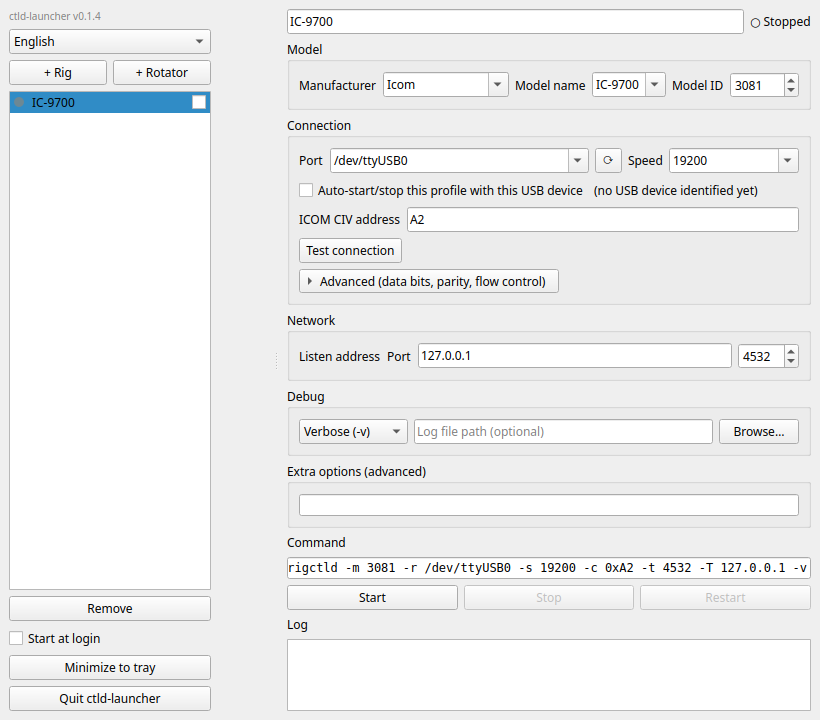

# ctld-launcher

🌐 [日本語](README.ja.md) | English

A GUI launcher for Hamlib's `rigctld` (rig control daemon) and `rotctld` (rotator control daemon) — configure and start them without touching the command line.

Pick your rig/rotator's manufacturer and model, serial port, and baud rate from dropdown menus, and launch `rigctld`/`rotctld` with one click. Hamlib itself (`rigctld`/`rotctld`/`rigctl`/`rotctl`, version 4.7.1) is bundled, so there's no need to install Hamlib separately.

Available for Linux, Windows, and macOS.



For background and technical/architecture details, see [CLAUDE.md](CLAUDE.md) (Japanese).

## Installation

Download the file for your OS from the [Releases](https://github.com/JF9SOM/ctld-launcher/releases) page.

### Linux

Download `ctld-launcher-x86_64.AppImage`, make it executable, and run it.

```bash
chmod +x ctld-launcher-x86_64.AppImage
./ctld-launcher-x86_64.AppImage
```

### Windows

Download and run `ctld-launcher-Setup.exe`, then follow the installer prompts. If you see a "Windows protected your PC" warning, click "More info" → "Run anyway" (this warning appears because the build isn't code-signed, not because of anything unusual about it).

### macOS

Download `ctld-launcher.dmg`, open it, and copy `ctld-launcher.app` to your Applications folder (or wherever you like). On first launch, macOS will warn that it can't verify the developer and offer to move the app to the Trash — **close that dialog without deleting it**. Then open the Apple menu → System Settings → Privacy & Security, scroll down to the message saying `"ctld-launcher" was blocked to protect your Mac`, click **Open Anyway**, and confirm "Open" in the dialog that follows. This is because the build is only ad-hoc signed, not notarized by Apple — after the first launch, it opens normally.

## Configuration

When the app starts, you'll see a list of profiles on the left and a settings form on the right.

1. Click "+ Rig" or "+ Rotator" in the top-left to add a new profile.
2. At the top of the form, give the profile a name you'll recognize (e.g. "IC-9700").
3. In the "Model" section, select your rig/rotator's manufacturer and model. Both dropdowns are searchable — type to filter the list. If your model isn't listed, you can type Hamlib's numeric model ID directly into the "Model ID" field instead.
4. In the "Connection" section, select the serial port your rig/rotator is connected to, and the baud rate configured on the radio itself. If you plug in the cable after opening the app, click the refresh button next to the port dropdown to rescan.
   - For USB-connected devices, turn on "Auto-start/stop this profile with this USB device" to have this profile start automatically whenever that USB device is plugged in, and stop automatically when it's unplugged (connect the device and select its port first, then turn this on). This only works while ctld-launcher itself is running — it doesn't start on login by itself; combine it with "Start at login" in the left sidebar if you also want that.
   - An "ICOM CIV address" field appears only for ICOM rigs. Enter the address exactly as shown on the radio's own settings screen (e.g. `A2` — no need to add "0x"). Leave it blank for other manufacturers.
   - The advanced settings (data bits, parity, flow control) can usually be left as "(Not set)". Only change them if your radio or interface's manual specifies a particular value.
5. In the "Network" section, set the address and port that `rigctld`/`rotctld` will listen on. Leaving this at 127.0.0.1 (only software on this same PC can connect) is fine for most setups; change it to 0.0.0.0 only if you want other PCs on your LAN to be able to connect. The port number must also match what your rig control software is configured to use (defaults are 4532 for rigs, 4533 for rotators).
6. If needed, use the "Debug" section to set log verbosity or a log file path.
7. Hover over any field to see a tooltip with a short explanation — check there if you're unsure what a setting does.

Settings are saved automatically; there's no separate save button.

## Usage

- Once configured, click "Start" to launch `rigctld`/`rotctld`. The "Command" field near the bottom of the form shows the exact command line that will be run, before you start it.
- Before starting, you can click "Test connection" to run a single one-shot query via `rigctl`/`rotctl` and confirm the port, speed, and model settings are correct. Note that if the radio is powered off or the cable isn't connected, `rigctld` itself will still start and keep running — it just won't respond to your rig control software — so it's worth testing the connection first.
- Use "Stop" and "Restart" to stop or restart a running process. The "Log" panel shows `rigctld`/`rotctld`'s console output.
- Switching the ON/OFF toggle next to a profile's name in the list on the left to ON makes that profile launch automatically whenever the app starts. Turning on "Start at login" at the bottom of the sidebar makes the app itself launch into the system tray automatically when you log in.
- Launching the app (clicking its icon, or running `ctld-launcher`) normally opens the settings window right away. Only when launched automatically at login does it start minimized to the tray, without opening the window.
- Closing the window doesn't quit the app — it stays running in the system tray (the "Minimize to tray" button at the bottom of the sidebar does the same thing). Left-click the tray icon to bring the settings window back; right-click it for a menu with per-profile start/stop, "Open settings…", and "Quit". To fully quit the app, use "Quit" from the tray menu, or the "Quit ctld-launcher" button at the bottom of the sidebar.
- Use the combo box in the top-left to switch the display language between English and Japanese (no restart needed).
- The bundled Hamlib version is shown just below the app version in the top-left. Below that is a "Check for updates" link — click it anytime to check GitHub for a newer ctld-launcher release (it also checks automatically once at startup). When a newer version is found, the link changes to "↑ Update to vX.Y.Z available" — click it again to download and install. You'll be asked to confirm the restart afterward (choose "later" if you don't want to interrupt currently-running profiles; the update is already applied, so it takes effect on your next manual restart either way).

## Development

```bash
pip install -e ".[dev]"
pytest
```

See [CLAUDE.md](CLAUDE.md) (Japanese) for details.
